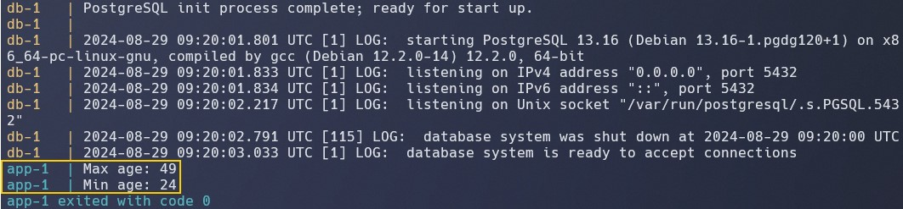

# Занятие 6.10. Промежуточная аттестация

## Задание

Запуск:
```bash
cd 2024-08-23_6.10
docker compose up --build
```

- Результат выполнения python-скрипта на рисунке ниже
    
- Создаваемая таблица test_table есть в файле `test_data.csv`
- В `docker-compose.yml` для `db` `start_period` установлен на `120s`, чтобы дать БД достаточно времени для инициализации (в моём случае при меньшем времени может завершаться с `dependency failed to start: container db-1 is unhealthy`). Значение можно уменьшить.